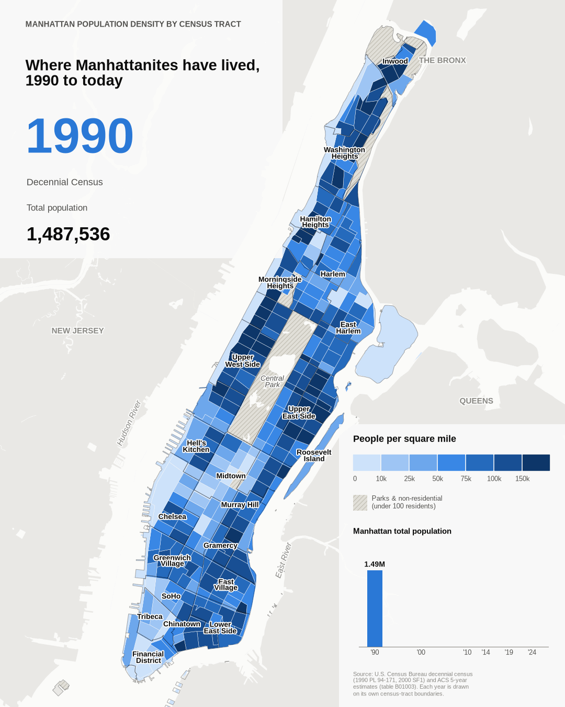

# Manhattan population by census tract, 1990 to today

An animated tract map of Manhattan's population density from the 1990
census through the latest ACS 5-year estimate, with neighborhood labels,
for web publication. Also exported as MP4 and as one PNG per year.



## Data

| Years | Population | Tract boundaries |
|---|---|---|
| 1990 | Census Bureau 1990 PL 94-171 redistricting file | Census Bureau 1990 cartographic tracts |
| 2000 | Census 2000 SF1 (Census API, `P001001`) | Census Bureau 2000 cartographic tracts |
| 2006–10, 2010–14, 2015–19, latest | ACS 5-year estimates, table B01003 | TIGER cartographic tracts of the matching vintage |

All sources come directly from the Census Bureau. Each year is drawn on its
own tract boundaries, clipped to Manhattan's land (TIGER area-water removed,
22.65 sq mi). Tracts are colored by **people per square mile of land**, which
stays comparable even though the tract lines change. Tracts with fewer than
100 residents (parks, rail yards and similar) are hatched. Totals match the
official counts: 1,487,536 in 1990, including 257 "crews of vessels" with no
mappable tract, and 1,537,195 in 2000.

Going back to 1950 (`--start 1950`) needs IPUMS NHGIS, the only source of
digitized pre-1990 tract boundaries, and an IPUMS account registered for NHGIS.

## Run it

```bash
pip install -r requirements.txt
export CENSUS_API_KEY=...   # https://api.census.gov/data/key_signup.html
python fetch_data.py        # 1990 -> today; writes data/processed/
python make_gif.py          # writes output/manhattan_population.gif, .mp4, and a PNG per year
```

For 1950 onward: `IPUMS_API_KEY=... python fetch_data.py --start 1950`, or download
the NHGIS extract yourself and add `--nhgis-dir <folder with the *_csv.zip and *_shape.zip>`.

Timing flags: `--hold` (seconds per year, default 1.5), `--first-hold` (2.5),
`--last-hold` (3.5), `--fade` (crossfade seconds, 0.4).
