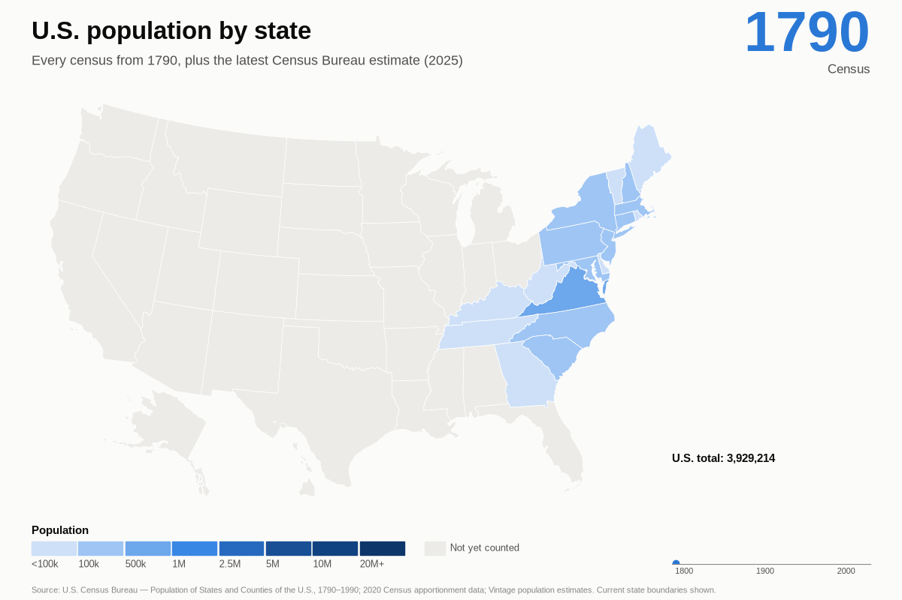

# U.S. population by state, 1790 to today

A simple animated map of every state's population at every census since the
first one in 1790, ending with the latest Census Bureau estimate.



## Data (all U.S. Census Bureau)

| Years | Source |
|---|---|
| 1790–1900 | *Population of States and Counties of the United States: 1790–1990* (1996), Part II state tables |
| 1910–2020 | 2020 Census apportionment data (`apportionment.csv`), resident population |
| 2025 | Vintage 2025 state population estimates (`NST-EST2025-alldata.csv`); there is no 2026 figure yet |

The 1790–1900 figures come from a scanned PDF. `parse_1790_1900.py` reads them
by position on the page, then checks that the states add up exactly to the
printed U.S. total for every census from 1790 to 1920, and that 1910 and 1920
match the apportionment file. Two OCR problems were checked against the scan
and corrected: Arizona 1890 (88,243) and a speck in Nebraska's empty 1810 cell.

Areas are shown within today's state boundaries, as the Census Bureau's
historical table reports them (for example, Kentucky's 1790 count, when it
was still part of Virginia). Gray means no count for that area yet.

## Run it

```bash
curl -o data/raw/population-of-states-and-counties-of-the-united-states-1790-1990.pdf https://www2.census.gov/library/publications/decennial/1990/population-of-states-and-counties-us-1790-1990/population-of-states-and-counties-of-the-united-states-1790-1990.pdf
curl -o data/raw/apportionment.csv https://www2.census.gov/programs-surveys/decennial/2020/data/apportionment/apportionment.csv
python parse_1790_1900.py
python make_state_gif.py    # writes output/state_population.gif
```
